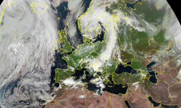

# Python Image Library Functions

Several routines that can be used to modify base imagery and produce useful output.

Run each with the format:

```python3 functionFile.py MYFILENAME {CPU}```

Where the optional CPU flag allows the output of processor benchmark utilisation for the function time-sliced every 10ms.

# Output

## Primary Source Image:


## Edge Detect : GrayScale


## Edge Detect : Heavy Edge


## Noise Reduction


## Thumbnail



